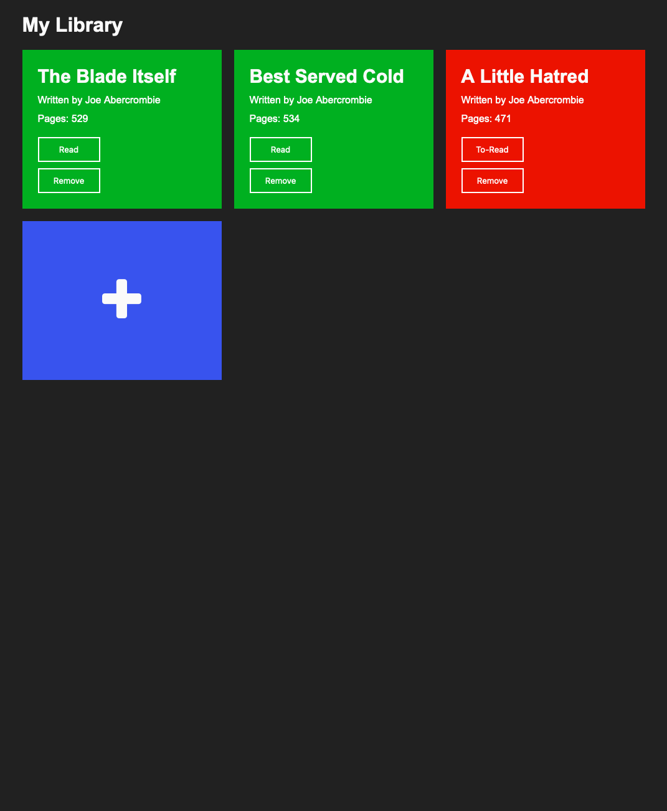

# library

A library app that allows the user to add new books to their read/to-read list also uses the Web Storage API to store the data, made for The Odin Project.

This was built using HTML, CSS and JavaScript.

